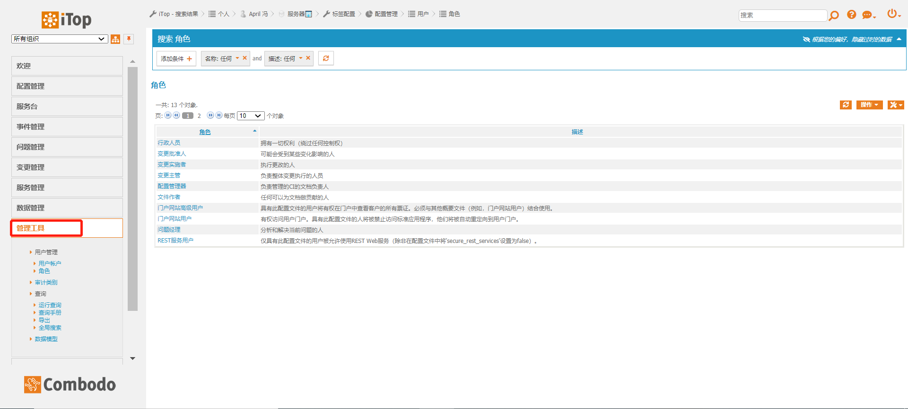

## 该文档尚未维护，点击下方链接加入我们一起来学习维护

[点击此处加入QQ群【iTopDB.com】](https://jq.qq.com/?_wv=1027&k=iY5f6Yys) QQ群号：657615256

### 管理工具

管理工具模块（角色）

#### 管理工具模块提供以下功能：

* iTop用户帐号管理：可新建，修改帐号，修改帐号密码，变更联系人，组织，角色等；
* iTop角色管理：可增加角色，定义角色的权限；
* 通知功能管理：通过触发器发送邮件等信息给指定人员；
* 审计类别管理：可新增，删除，修改审计规则；
* 运行查询；
* 查询手册（新建 OQL 查询）；
* 导出，与第三方工具结合，设定数据源，批量实时导入数据；
* 全局搜索
* 数据模型管理；（可以二次开放根据公司情况修改xml配置）
