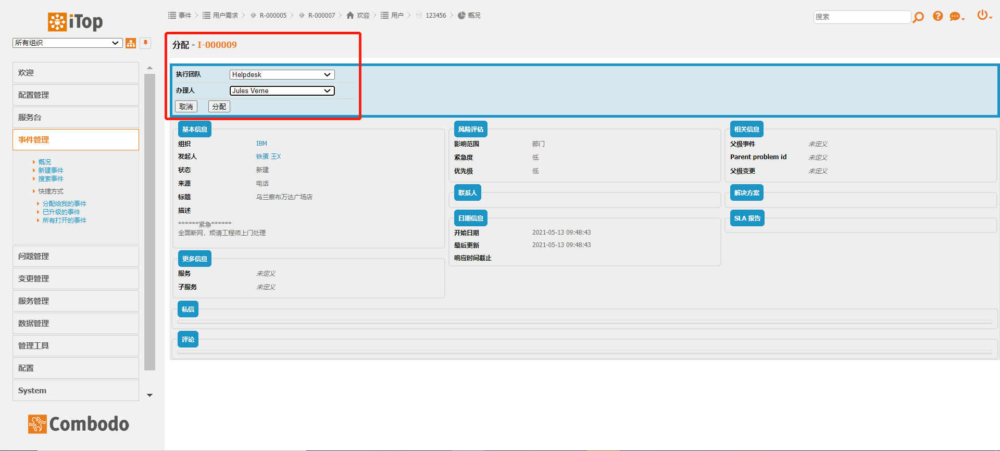
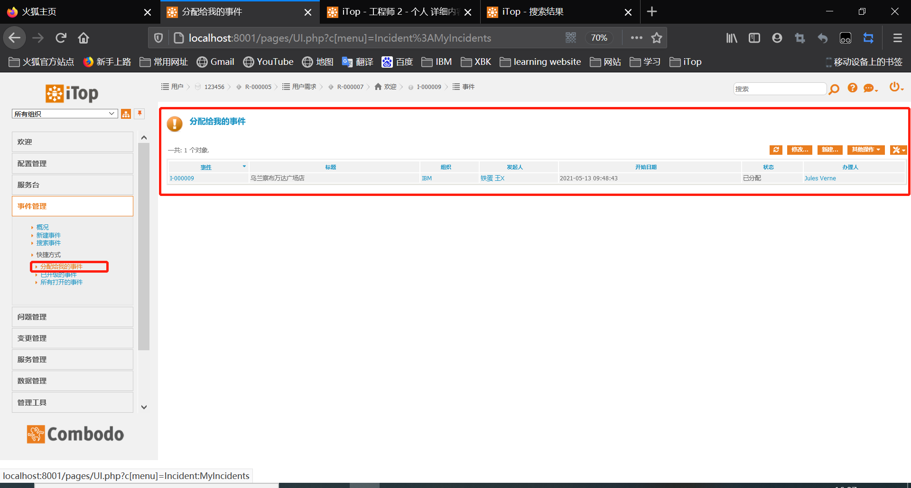
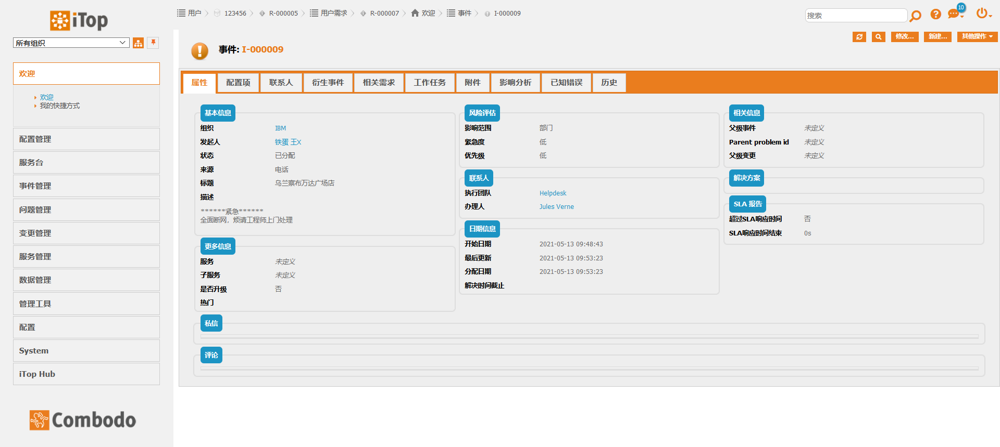
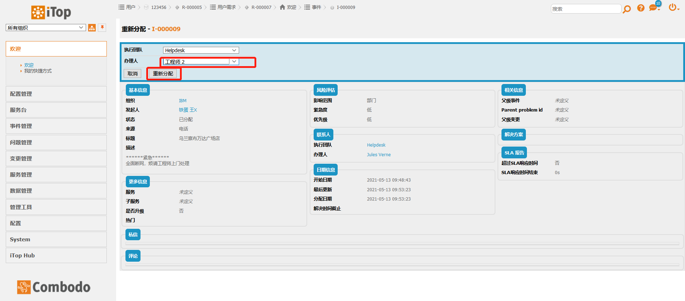
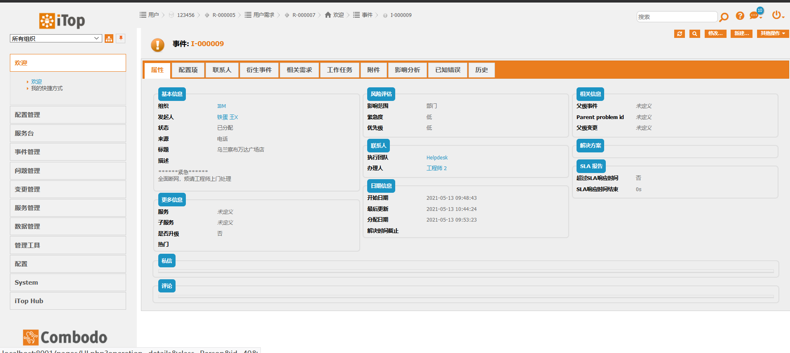
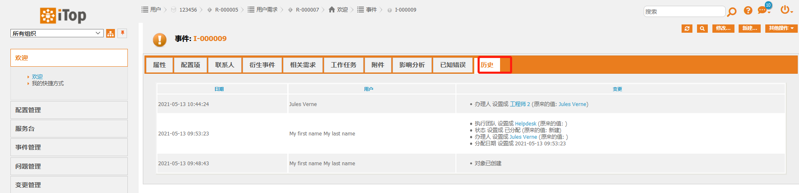
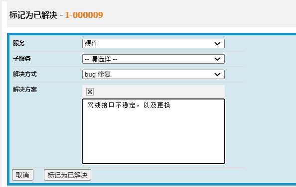

### 事件管理

#### 关键流程活动：创建，指派，暂挂，重指派，完成，重新打开，满意度调查，关闭。

#### 我们假设：服务台接到报障，组织IBM人说门店乌兰察布万达广场店全面断网，服务台人电话指引他如何检查断网的问题，但是还是不成功，于是服务台的人员铁蛋王就把这个事件记录了下来，指派给了 Helpdesk团队的Jules Verne工程师，工程师Jules Verne接到单并到现场处理，30分钟后还是没有头绪，于是将单转派给了水平更高的工程师工程师2，工程师2花了20分钟处理好了。完整的操作步骤如下。

#### 1.服务台人员用admin（超级管理员，拥有最高权限）账号登陆系统，进入iTop系统后，选择事件管理后，选择事件管理--新建事件，进入登记事件页面，登记后指派给工程师Jules Verne（办理人），见图1-1。

图1-1 事件单指派

#### 2.办理人接到工单，用他的账号123456登录，登录后点击事件管理--指派给我的事件。如图1-2。

图1-2本人的事件单

#### 3.点击事件编号，查看事件工单详细内容，见图1-3

图1-3 事件内容浏览

#### 4.工程师Jules Verne因无法处理而将工单转给工程师2，于是点击 其他操作 下拉列表的”重新指派“，对手上的事件工单进行升级转派：选择好重指派的办理人后，点击下方”重指派“，即可完成升级转派动作；见图1-4

图1-4 事件单指派

#### 5.工程师2使用帐号登录，查看事件工单，通过属性选择卡的日志以及选项卡历史可以查到历史记录和派单操作，见图1-5，图1-6

图1-5 事件单内容浏览

图1-6，事件操作流程记录浏览

#### 6.点击其他操作 列表下拉的”标记为已解决“，填写相应解决方案，然后点下下方”标记为已解决“，见图1-7。

#### 7.点击【其他操作】下拉列表的【关闭】，进入到关闭环节，填写用户满意度并关闭工单。

#### 8.申请关闭后，显示全部的字段内容。
