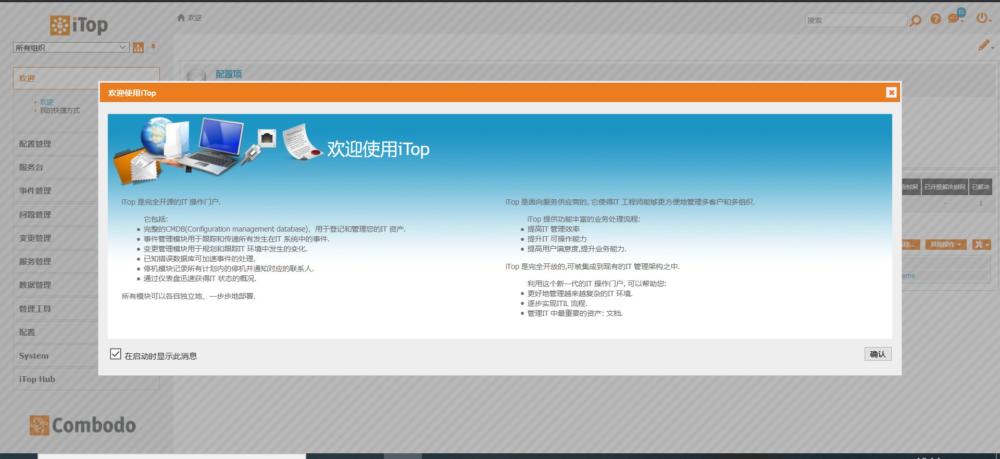
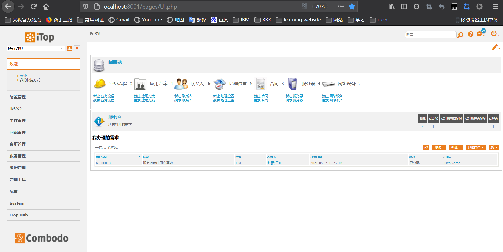
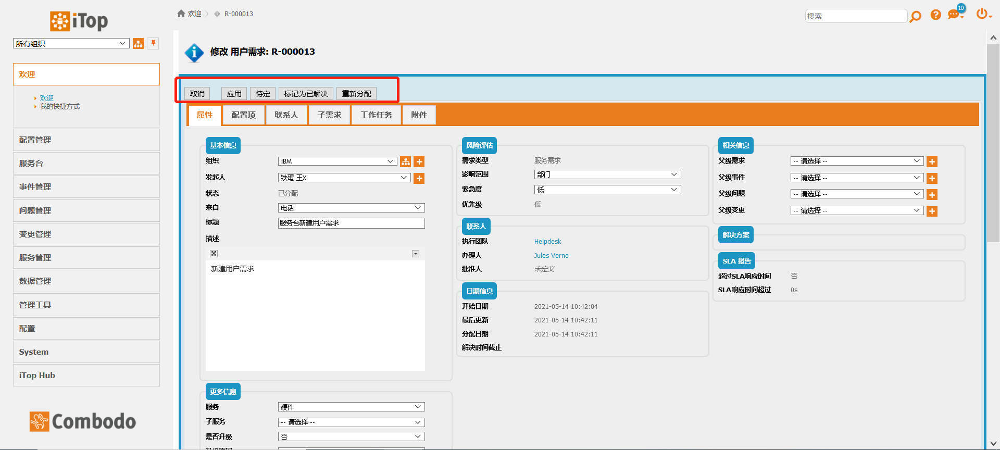
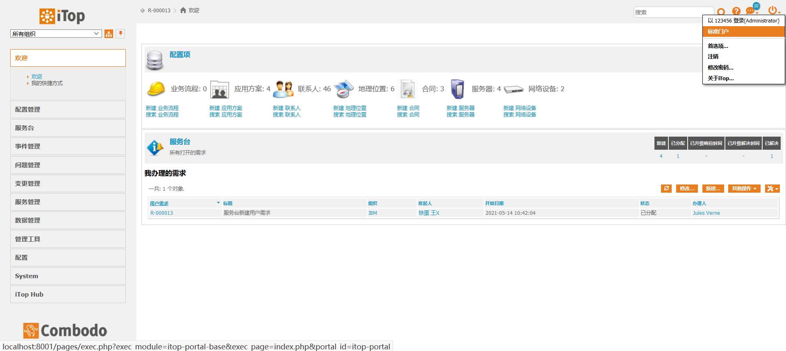
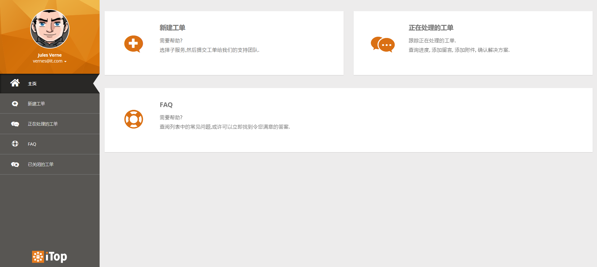
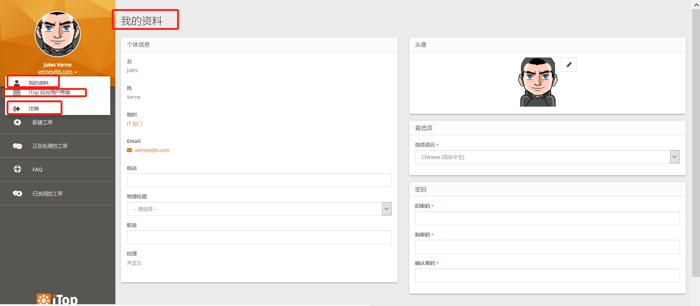
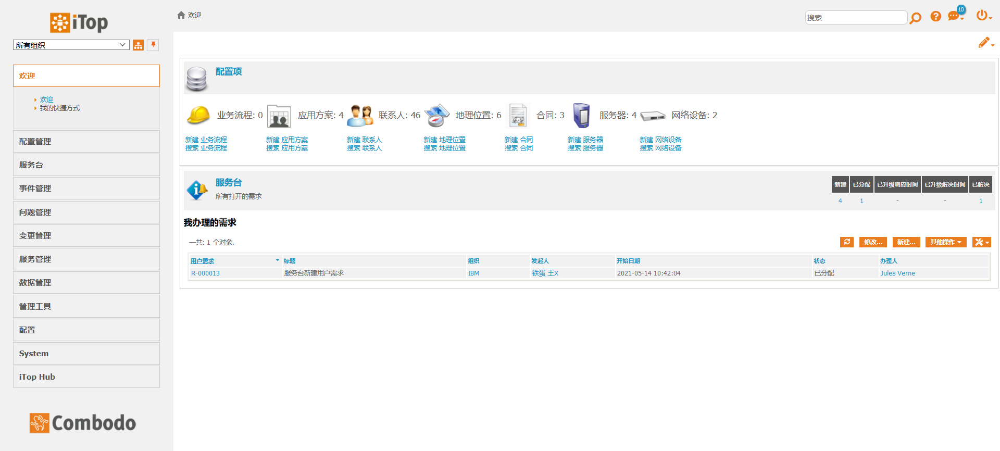
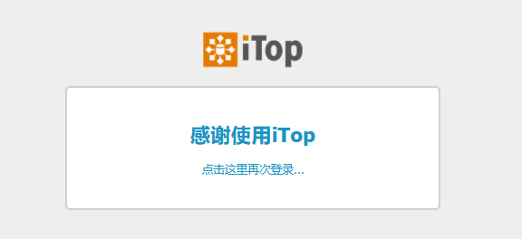
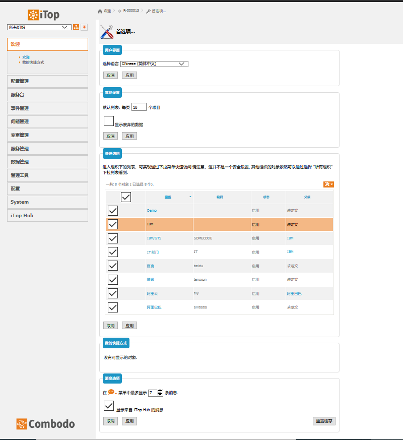

### 首页项

#### 安装完之后，首页登录是这个欢迎使用iTop界面，见图1-1。

图1-1 欢迎使用iTop界面

#### 点击确认之后，映入眼帘的是欢迎界面，这里主要查看的是项目经理分配给我们的用户需求工单，见图1-2。

图1-2 需要我办理的用户需求

#### 点击用户需求代码，进去之后我们可以对工单进行修改，修改完可以点击应用；待定的话可以暂缓SLA,SLT的时间；标记为已解决这个工单就完结了；要是自己解决不了可以重新分配给更高级的工程师；

图1-2 修改用户需求

#### 然后我们在次回到欢迎界面，点击右边的标准门户，见图1-3。

图1-3点击标准门户

#### 可以看到我们的前端页面；主页有 新建工单，正在处理的工单，还有FAQ(常见问题解答)，左边菜单栏分别是 主页，新建工单，正在处理的工单，FAQ，已关闭的工单，见图1-4。

图1-4 itop前端页面

#### 点击我的Email,可以查看我的资料有个人的详细信息，比如姓名，组织，Email，电话，地理位置，还可以修改密码等等...见图1-5；点击iTop后台用户界面，就默认进入到刚开始的欢迎界面了，还有后台的信息，见图1-6；点击注销就退出帐号，见图1-7；

图1-5 iTop前端 我的资料页面

图1-6 点击iTop后台用户界面进入欢迎界面

图1-7 注销

#### 然后我们在次回到欢迎界面，点击右边的首页项，首页项可以配置 用户界面语言，每个列表显示的每页数据，右边菜单下拉显示的组织，添加的快捷方式，左边消息显示iTopHub的多少条消息，见图1-8。

图1-7 首页项配置

