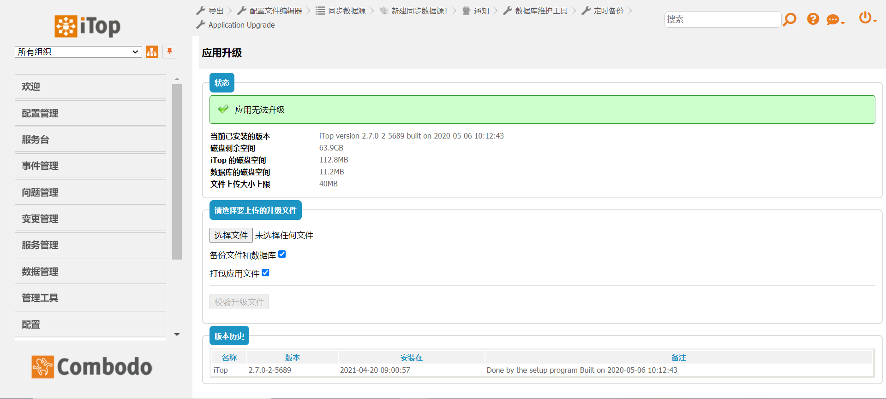

### System工具

#### System第一个是DB工具，主要功能检查数据库的一致性，和丢失的附件（在这里，您可以搜索数据库以查找丢失或放错的附件。这不是数据恢复工具，也不是检索已删除的数据。）见图1-1。

图1-1 DB工具

#### 定时备份模块，可以将mysql里的数据库进行备份，见图1-2。

图1-2 定时备份

#### 应用升级，iTop官网如果有最新的版本可以进行升级，选择要升级的文件就可以了(我这个是最新版本不可以升级，过一段时间可能出3.0版本)，见图1-3。

图1-3 应用升级

