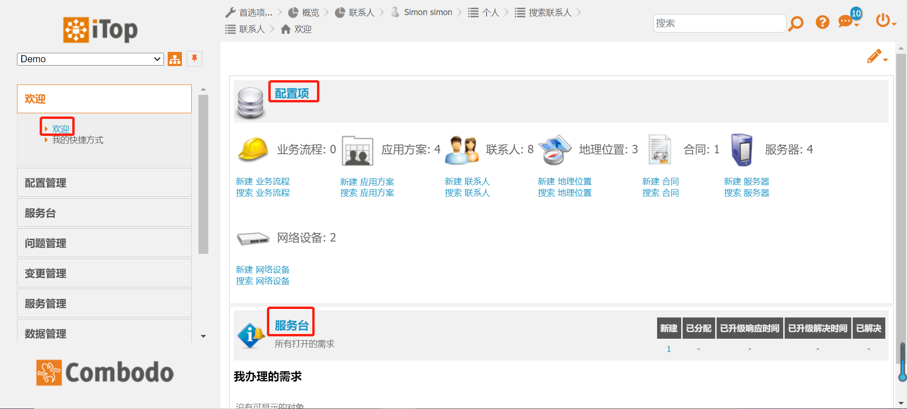
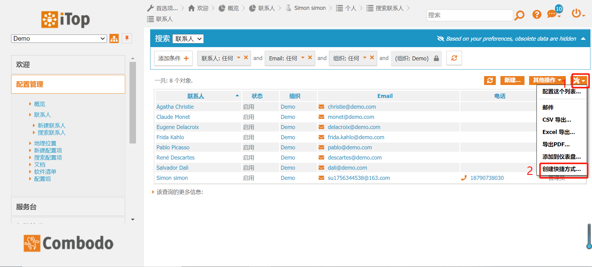
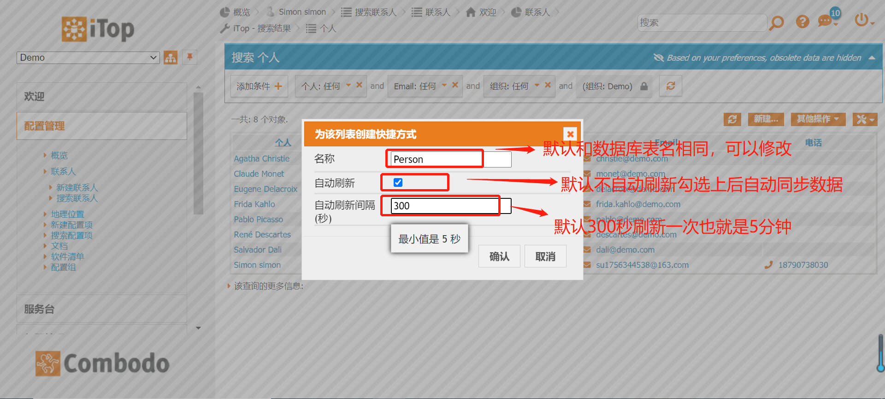

##  欢迎模板

#### 欢迎模块 默认显示的是配置项和服务台的信息，见图1-1。

图1-1 欢迎

#### 欢迎模块 可以把我们经常要使用的信息添加到的快捷方式里 例如：(把联系人添加到我的快捷方式里)

####  操作如下：

##### 点击 配置管理-->联系人-->搜索联系人-->点击搜索（默认显示全部人员信息，这里我们可以根据条件筛选，同理添加其他快捷方式一样），见图1-2，1-3。

图1-2 把联系人添加到快捷方式里

图1-3 如何配置快捷方式

##### 设置完以后就可以看见我们的快捷方式里面已经存在了（在右上角的开机键，首页选择中也可以查到,勾选Person可以删除快捷方式），见图1-4。

添加的快捷方式 Person

首页项

