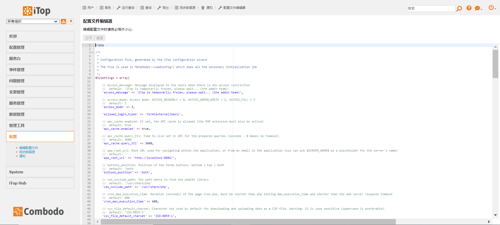
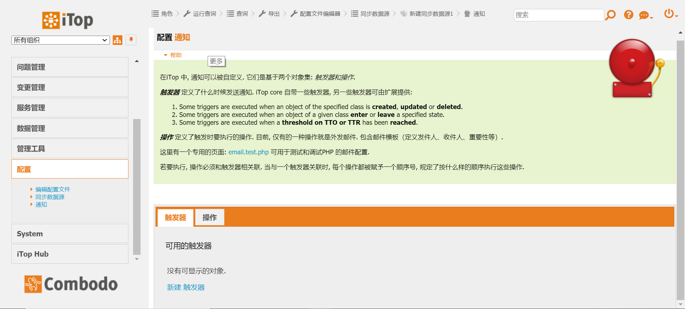

### 配置

### 1.编辑被指文件

配置文件

#### 1.常见配置

* 系统访问地址。形式类似于'app_root_url' => 'http://localhost:8001/',这里我们使用的是Ip地址,也可以使用域名，但必须在访问登录时使用这个设置的URL地址，否则，一些内容会出现显示不全的情况；

* 数据库连接信息，根据实际情况设置即可；主要信息如下内容。

  + 	'db_character_set'=>'utf8',
      	
      	'db_collation'=>'utf8_unicode_ci',
     	
      	'db_host' => 'localhost:3307',
     	
      	'db_name' => 'iTop22',
     	
      	'db_pwd' => '',
     	
      	'db_subname' => '',
     	
      	'db_user' => 'root',

* 邮件服务器。系统默认使用的是内置邮件服务‘email_transport’=>'PHPMail',我们可以使用SMTP来设置，格式如下：

  	    'email_transport' => 'SMTP',
    		'email_transport_smtp.host' => '宿主主机',
    		'email_transport_smtp_password' => '密码',
    		'email_transport_smtp_port' => '端口',
    		'email_transport_smtp_username' => '用户账户',
    	    'email_transport_smtp_from' => '来自那个邮箱',

* Portal 工单类型。可以设置成以下形式：

  

	       'portal_tickets'=>'UserRequest',
	       'portal_tickets'=>'Incident',
	       'portal_tickets'=>'UserRequest，Incident',

* 时区。默认是'timezone' => 'Europe/Paris'（欧洲，巴黎）,我们可以改为‘timezone’=>'Asia/ShangHai';(亚洲，上海)；

* LDAP服务器信息。z主要配置通过外部密码系统进行密码验证，如通过微软的域控制器AD:

  	'authent-ldap' => array (
  		'host' => 'localhost',
  		'port' => 389,
  		'default_user' => '',
  		'default_pwd' => '',
  		'base_dn' => 'dc=yourcompany,dc=com',
  		'user_query' => '(&(uid=%1$s)(inetuserstatus=ACTIVE))',
  		'options' => array (
  		  17 => 3,
  		  8 => 0,
  		),
  		'start_tls' => false,
  		'debug' => false,

* 备份策略信息：

  		'itop-backup' => array (
  			'mysql_bindir' => '',
  			'week_days' => 'monday, tuesday, wednesday, thursday, friday',
  			'time' => '23:30',
  			'retention_count' => 5,
  			'enabled' => true,
  			'itop_backup_incident' => '',

####删除密码安全性策略
https://www.itophub.io/wiki/page?do=export_code&id=3_0_0%3Aadmin%3Apassword-policy&codeblock=0

### 2.同步数据源

**联合多个来源**

强大的数据同步引擎允许将多种信息源（例如，在使用网络发现工具或资产管理工具时）联合到[iTop](http://itophub.cn/)中。

**使用数据源对象联合**

在iTop中使用数据源对象定义了该联合。请参阅数据源 每个数据来源都定义了iTop如何处理来自给定来源的给定类型对象的同步。

**用于同步数据的通用流程**

用于将数据与iTop同步的通用（正在进行的）流程基于以下步骤：

- 从外部源应用程序中提取数据[iTop未处理]
- 将数据转换为适合iTop的内容格式[iTop不处理]
- 使用MySQL命令[未由iTop处理]将导入和数据放入iTop中的副本表中
- 搜索用于在iTop中匹配对象[由iTop处理]
- 在iTop中创建或更新同步对象[由iTop处理]
- 在iTop中显示和管理同步的对象

**CSV导入和数据同步有什么区别？**

数据同步

数据同步是指以循环方式将导入数据从另一个系统转换为iTop。它可以从命令行或从Web运行，但不能交互运行。数据同步针对不经常使用数据的大量数据进行了优化。例如，每天可以在iTop中同步来自LDAP数据的10,000个联系人。每天不会修改多于一小部分的用户记录。 iTop可以有效地处理此问题。

同步数据时，iTop会跟踪iTop对象和数据的源之间的关系。因此，可以防止用户修改iTop中的同步对象（部分或全部），并通知他们数据的来源。这对于在iTop中“联合”数据的多个源很有用。

CSV导入

CSV导入可以交互方式运行，也可以从命令行运行。它更针对“一次性”进口。可以从脚本（使用命令行界面或从Web）或交互式使用它。执行CSV导入时，iTop不会提供有关记录来源的导入信息。将记录加载到iTop中后，授权用户可以修改对象，而原始源无需任何引用。

总结一下：

CSV导入适用于：

- 将初始数据导入iTop
- 在数据上执行批量转换（有时导出>在Excel中修改> re-import比直接在iTop中编辑对象要容易）

同步有益于：

- 在iTop中的不同系统之间联合数据
- 通过某些计划机制导入数据
- 防止用户修改导入的数据

***\*
\**
同步配置项目**

当配置项与数据源同步时，iTop中的显示会略有不同。配置项上的操作活动也可能是受限的，数据源的配置上是依赖。

例如，对于最终用户，同步的对象的字段可能显示为只读。还可以配置iTop以防止用户删除同步的对象。同步对象的确切行为由每个配置项源的属性确定。

### 通知

通知

#### 可以创建触发器，比如人员更新时触发，临界值触发，对象创建触发...

